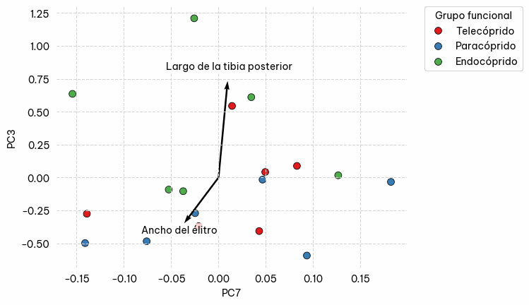

# Clasificación de grupos funcionales de Scarabaeinae (Coleoptera: Scarabeidae) de Colombia mediante Máquinas de Soporte Vectorial

Los Scarabaeinae constituyen una subfamilia de escarabajos de la familia Scarabaeidae, ampliamente reconocidos por su hábito coprófago. Estos insectos no solo se alimentan de materia fecal, sino que además utilizan el estiércol como sustrato para el desarrollo de sus crías. En función del uso que hacen del recurso, ya sea alimenticio, reproductivo o constructivo. Los escarabajos coprófagos han evolucionado hacia estrategias conductuales diversas, que impactan directamente en la descomposición del estiércol y en la regulación de otros organismos que dependen del mismo recurso, como las moscas coprófagas (Doube, 1990). El modo en que los adultos manipulan, entierran o nidifican en el estiércol permite clasificarlos en grupos funcionales, y han sido tradicionalmente agrupados en 3 grupos (Halffter & Edmonds, 1982). Estos grupos no se basan en parentesco filogenético, sino en la función ecológica que desempeñan. Así, se distinguen:

**Paracópridos:** excavan túneles verticales u oblicuos justo debajo del estiércol y allí lo entierran, formando cámaras de cría. Pueden hacerlo rápidamente (entierro en horas) o lentamente (días o semanas).

**Telecópridos:** separan fragmentos de estiércol, los moldean en bolas y los transportan horizontalmente a cierta distancia antes de enterrarlos. Esta estrategia favorece la dispersión espacial del estiércol.

**Endocópridos:** nidifican dentro del mismo excremento, sin desplazarlo, formando las estructuras reproductivas en el interior del estiércol en descomposición.

Este repositorio ofrece un modelo de máquinas de soporte vectorial para clasificar el grupo funcional utilizando 8 medidas morfométricas lineales:

1\. Ancho del élitro  
2\. Largo del élitro  
3\. Largo del cuerpo  
4\. Ancho del cuerpo  
5\. Largo del fémur anterior  
6\. Largo de la tibia anterior  
7\. Largo del fémur posterior  
8\. Largo de la tibia posterior

El ejemplo de como usar este modelo se encuentra en example.py.

## Entrenamiento del Modelo

El modelo fue entrenado utilizando datos provenientes de **2,245 individuos** recolectados en **13 ecorregiones** de Colombia. Se aplicó un **Análisis de Componentes Principales (PCA)**. Posteriormente, se utilizó una **Máquina de Vectores de Soporte (SVM, por sus siglas en inglés)** para la clasificación de los individuos según su comportamiento de enterramiento.

A continuación, se presentan las métricas de desempeño del modelo por clase:

| Clase         | Precisión | Recall | F1-Score | Soporte |
|---------------|-----------|--------|----------|---------|
| Endocóprido   | 1.00      | 0.91   | 0.96     | 47      |
| Paracóprido   | 0.92      | 0.97   | 0.95     | 427     |
| Telecóprido   | 0.93      | 0.84   | 0.88     | 200     |
| **Exactitud total** |           |        | **0.93** | **674** |
| **Promedio Macro** | 0.95      | 0.91   | 0.93     | 674     |
| **Promedio Ponderado** | 0.93  | 0.93   | 0.93     | 674     |

Estas métricas indican un desempeño general robusto, con una exactitud global del **93%**, destacándose especialmente la precisión en la clasificación de la categoría **Endocóprido**.

## Agrupación de Comportamientos mediante PCA

El análisis de componentes principales permitió evidenciar la agrupación natural de los tres tipos de comportamientos de enterramiento (**Endocóprido**, **Paracóprido** y **Telecóprido**), lo que sugiere que las variables utilizadas contienen suficiente información estructural para discriminar entre estas categorías.

## Referencias
- Abdi, H., & Williams, L. J. (2010). Principal component analysis. Wiley Interdisciplinary Reviews: Computational Statistics, 2(4), 433–459. https://doi.org/10.1002/wics.101
- Chang, C.-C., & Lin, C.-J. (2022). LIBSVM: A Library for Support Vector Machines. https://www.csie.ntu.edu.tw/~cjlin/papers/libsvm.pdf
- Cupello, M., Silva, F. A. B., & Vaz-De-Mello, Fernando Z. (2024). Corrigendum: The Taxonomic Revolution of New World dung beetles (Coleoptera: Scarabaeidae: Scarabaeinae). Frontiers in Ecology and Evolution, 12. https://doi.org/10.3389/fevo.2024.1369318
- deCastro ‐Arrazola, I., Andrew, N. R., Berg, M. P., Curtsdotter, A., Lumaret, J., Menéndez, R., Moretti, M., Nervo, B., Nichols, E. S., Sánchez‐Piñero, F., Santos, A. M. C., Sheldon, K. S., Slade, E. M., & Hortal, J. (2022). A trait‐based framework for dung beetle functional ecology. Journal of Animal Ecology, 92(1), 44–65. https://doi.org/10.1111/1365-2656.13829
- Doube, B.M. (1990), A functional classification for analysis of the structure of dung beetle assemblages. Ecological Entomology, 15: 371-383. https://doi.org/10.1111/j.1365-2311.1990.tb00820.x
- Halffter, G. & Edmonds, W.. (1982). The nesting behavior of dung beetles (Scarabaeinae). An Ecological and Evolutive Approach. 10.
- Medina, C. A., Lopera-Toro, A., Vítolo, A., & Gill, B. (2001). Escarabajos coprófagos (Coleoptera: Scarabaeidae: Scarabaeinae) de Colombia. Biota Colombiana, 2(2). https://revistas.humboldt.org.co/index.php/biota/article/view/95
